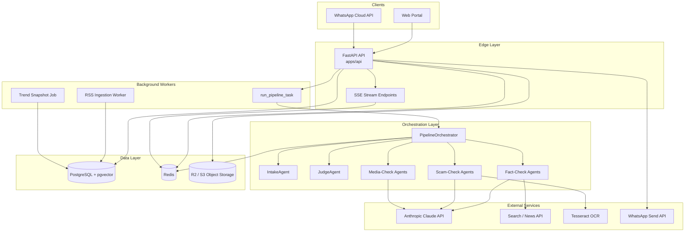

# Nigehban Backend — Production Specification

**Document type:** Production engineering specification  
**Product:** Nigehban — Pakistan's AI-Powered Fact-Check, Scam-Detection & Deepfake-Verification Portal  
**Scope:** Backend API, AI pipeline, data layer, integrations, deployment, and operations  
**Companion doc:** [`Nigehban_PRD.md`](./Nigehban_PRD.md)  
**Codebase root:** `apps/api/`  
**Version:** 1.0  
**Last updated:** August 29, 2026  
**Status:** Draft — architecture implemented; production hardening in progress

---

## Table of Contents

1. [Executive Summary](#1-executive-summary)
2. [Production Goals & Success Criteria](#2-production-goals--success-criteria)
3. [System Architecture](#3-system-architecture)
4. [Technology Stack](#4-technology-stack)
5. [API Specification](#5-api-specification)
6. [Data Model & Database](#6-data-model--database)
7. [Multi-Agent AI Pipeline](#7-multi-agent-ai-pipeline)
8. [Background Processing & Real-Time](#8-background-processing--real-time)
9. [External Integrations](#9-external-integrations)
10. [Security, Privacy & Compliance](#10-security-privacy--compliance)
11. [Performance & Scalability](#11-performance--scalability)
12. [Observability & Operations](#12-observability--operations)
13. [Deployment & Infrastructure](#13-deployment--infrastructure)
14. [Configuration Reference](#14-configuration-reference)
15. [Data Lifecycle & Retention](#15-data-lifecycle--retention)
16. [Implementation Status Matrix](#16-implementation-status-matrix)
17. [Production Readiness Checklist](#17-production-readiness-checklist)
18. [Phased Rollout Plan](#18-phased-rollout-plan)

---

## 1. Executive Summary

Nigehban's backend is a **Python FastAPI service** that exposes REST + SSE endpoints for three verification domains:

| Domain | User question | Pipeline path |
|--------|---------------|---------------|
| Fact-check | Is this claim true? | `factcheck` |
| Scam check | Is this message a scam? | `scamcheck` |
| Media authenticity | Is this image/video manipulated? | `mediacheck` |

All user submissions flow through a **multi-agent orchestration layer** (Intake → specialized agents → Judge) and persist results to PostgreSQL. Redis provides pub/sub for live updates and caching. Object storage (Cloudflare R2 / S3) holds uploaded media.

**Production intent:** A horizontally scalable, auditable, source-grounded verification platform suitable for public civic-tech use in Pakistan — not a demo-only prototype.

**Current state:** Core architecture and endpoint surface are implemented. Several production-critical integrations (real web search, real embeddings, Alembic migrations, Redis-backed workers, agent log persistence) remain incomplete. See [Section 16](#16-implementation-status-matrix).

---

## 2. Production Goals & Success Criteria

Mapped from PRD §3, §11, and §12.

### 2.1 Functional targets (production)

| ID | Requirement | Production target |
|----|-------------|-------------------|
| G1 | Speed to answer | Text/scam ≤ 15s p95; image ≤ 20s p95; video ≤ 45s p95 |
| G2 | One-stop coverage | All three paths live behind unified API + WhatsApp |
| G3 | Accessibility | Urdu + English explanations on every verdict; Roman Urdu input handling |
| G4 | Situational awareness | Dashboard trending refreshed at least every 15 minutes |
| G5 | Multi-agent transparency | Full `agent_logs` trail retrievable per check |
| G6 | Source grounding | No definitive True/False without retrievable source OR explicit Unverified |
| G7 | Confidence safety | Confidence &lt; 50 → forced safe verdict (unverified / needs_caution / inconclusive) |

### 2.2 Non-functional targets (production)

| Area | Target |
|------|--------|
| Availability | 99.5% monthly (excluding planned maintenance) |
| API latency (read) | Feed/dashboard GET p95 &lt; 300ms |
| API latency (submit) | HTTP 202 within 200ms; verdict async |
| Concurrent users | 500+ simultaneous read clients; 50+ concurrent pipeline jobs |
| Data durability | PostgreSQL with daily backups; R2 versioning enabled |
| Security | Rate limits, input validation, secrets in vault; no PII in public feed |
| Auditability | Every agent step logged with latency and confidence |

### 2.3 Demo vs production distinction

| Capability | Hackathon demo minimum | Production requirement |
|------------|------------------------|------------------------|
| Web search | Mock results acceptable | Live Bing/Google/News API with caching |
| Embeddings | Hash stub | OpenAI / Voyage / Cohere with pgvector indexes |
| Media forensics | LLM reasoning on URL | EXIF libs + open deepfake models + reverse image search API |
| Workers | `asyncio.create_task` in API process | Celery/RQ workers + Redis queue |
| Migrations | Manual schema | Alembic versioned migrations |
| Seed data | 20 claims + 30 scam patterns | Continuous ingestion + moderation workflow |

---

## 3. System Architecture

### 3.1 Component diagram



### 3.2 Request lifecycle (submit → verdict)

```
1. Client POST /api/v1/{path}/submit
2. API validates input, creates DB row (verdict = null)
3. API returns 202 { id, status: "processing" }
4. Background: run_pipeline_task(check_id, check_type, input_data)
5. PipelineOrchestrator.process():
   a. IntakeAgent → routing { path, language, input_type }
   b. Path agents (sequential + parallel per §7)
   c. JudgeAgent → final verdict + confidence floor
6. _save_result() updates claims / scam_reports / media_checks
7. Redis publish pipeline:{check_id} + feed:updates
8. Client polls GET /checks/{id} OR subscribes to SSE /checks/{id}/stream
```

### 3.3 Repository layout

```
apps/api/
├── app/
│   ├── main.py                 # FastAPI app, CORS, lifespan
│   ├── api/
│   │   ├── v1/                 # Versioned REST + SSE routes
│   │   └── webhooks/whatsapp.py
│   ├── agents/                 # Multi-agent pipeline
│   │   ├── base.py             # BaseAgent, Redis pub/sub, timeouts
│   │   ├── intake.py
│   │   ├── judge.py
│   │   ├── orchestrator.py
│   │   ├── factcheck/
│   │   ├── scamcheck/
│   │   └── mediacheck/
│   ├── core/                   # config, database, redis, security
│   ├── models/                 # SQLAlchemy ORM
│   ├── schemas/                # Pydantic request/response
│   ├── services/               # LLM, OCR, search, storage, embeddings, trends
│   ├── workers/                # tasks, ingestion
│   ├── cache/                    # Multi-layer cache (L1–L4)
│   └── utils/                  # rate limiter, PII redaction
├── alembic/                    # DB migrations (production: must be populated)
├── tests/
├── Dockerfile
└── pyproject.toml
```

---

## 4. Technology Stack

| Layer | Technology | Production notes |
|-------|------------|------------------|
| Runtime | Python 3.12 | Pin in Dockerfile and CI |
| API framework | FastAPI 0.115+ | OpenAPI at `/docs` |
| ASGI server | Uvicorn | 2–4 workers per instance behind load balancer |
| ORM | SQLAlchemy 2.0 async | `asyncpg` driver |
| Database | PostgreSQL 16 + pgvector | `pgvector/pgvector:pg16` image |
| Cache / pub/sub | Redis 7 | Separate logical DBs: cache (0), queue (1), pub/sub (0) |
| Task queue | Celery + Redis *(target)* | Currently `asyncio.create_task` — migrate for prod |
| LLM | Anthropic Claude | Haiku (classification), Sonnet (synthesis/judge) |
| OCR | Tesseract (`eng+urd`) | Bundled in Docker image |
| Object storage | Cloudflare R2 (S3 API) | Local `uploads/` fallback for dev |
| WhatsApp | Meta Cloud API v19.0 | Webhook + outbound messages |
| Container | Docker multi-stage build | See `apps/api/Dockerfile` |
| Monorepo | pnpm + turbo | API is independent Python package |

---

## 5. API Specification

**Base URL:** `https://api.nigehban.pk/api/v1` *(production)*  
**Dev base:** `http://localhost:8000/api/v1`  
**Auth:** None for public read/submit in v1 (anonymous). Admin routes planned post-v1.  
**Content types:** `application/json` for JSON bodies; `multipart/form-data` for file uploads.

### 5.1 Common conventions

#### Async submission pattern

All verification endpoints return **HTTP 202 Accepted** immediately. Clients must poll or use SSE.

```json
{ "id": "uuid", "status": "processing" }
```

#### Error envelope

```json
{ "detail": "Human-readable error message" }
```

| Status | Meaning |
|--------|---------|
| 400 | Malformed request |
| 422 | Validation failed (type, size, missing fields) |
| 413 | Upload exceeds size limit |
| 429 | Rate limit exceeded |
| 404 | Check not found |
| 500 | Internal error |

#### Rate limiting (production targets)

| Endpoint class | Limit | Window | Implementation |
|----------------|-------|--------|----------------|
| Submit (fact/scam/media/report) | 10 req | 60s / IP | `RateLimiter` dependency *(wire in prod)* |
| Read (feed, search, dashboard) | 60 req | 60s / IP | `RateLimitMiddleware` *(wire in prod)* |
| WhatsApp webhook | No IP limit | — | Verify Meta signature; queue internally |

**Production requirement:** Replace in-memory limiters with Redis sliding-window counters for multi-instance deployments.

---

### 5.2 System

#### `GET /health`

Unversioned: `GET /health`

**Response 200:**

```json
{ "status": "ok" }
```

**Production extension (recommended):**

```json
{
  "status": "ok",
  "db": "ok",
  "redis": "ok",
  "version": "0.1.0"
}
```

---

### 5.3 Fact-check

#### `POST /factcheck/submit`

Submit a text claim or statement for verification.

**Request body (`FactCheckSubmission`):**

| Field | Type | Required | Constraints |
|-------|------|----------|-------------|
| `text` | string | yes | 1–5000 chars |
| `url` | string | no | Source URL |
| `language` | string | no | Default `en` |

**Response 202:**

```json
{ "id": "550e8400-e29b-41d4-a716-446655440000", "status": "processing" }
```

**Pipeline:** Creates `claims` row → `check_type = "claim"` → factcheck path.

---

#### `GET /factcheck/feed`

Paginated list of completed fact-checks (verdict not null), newest first.

**Query parameters:**

| Param | Type | Default | Description |
|-------|------|---------|-------------|
| `cursor` | string | — | Keyset cursor (`created_at` ISO of previous item) |
| `limit` | int | 20 | 1–100 |
| `category` | string | — | `politics`, `health`, `finance`, `disaster`, `celebrity`, `other` |
| `q` | string | — | ILIKE search on title/body |

**Response 200:** `list[FeedItem]`

```json
[
  {
    "id": "uuid",
    "title": "Claim headline (first 512 chars of text)",
    "verdict": "false",
    "confidence": 87.5,
    "explanation_en": "Short explanation...",
    "category": "health",
    "source_count": 3,
    "created_at": "2026-08-26T10:15:00Z"
  }
]
```

**Production notes:**
- Apply PII redaction on `title`/`explanation` before public display
- Add composite index on `(verdict, created_at DESC)` and GIN index for full-text search

---

#### `GET /factcheck/feed/stream`

SSE subscription to channel `feed:updates`. New items published when pipeline completes.

**Headers:** `Content-Type: text/event-stream`  
**Timeout:** 300s  
**Event payload:** JSON with `id`, `type`, `verdict`, `confidence`, `explanation_en`, `timestamp`

---

### 5.4 Scam check

#### `POST /scamcheck/submit`

**Content-Type:** `multipart/form-data`

| Field | Type | Required | Description |
|-------|------|----------|-------------|
| `text` | string | no* | Suspicious message text |
| `file` | file | no* | Screenshot image |
| `language` | string | no | Default `en` |

*At least one of `text` or `file` required.

**Response 202:** `{ "id", "status": "processing" }`

**Pipeline:** OCR if image → pattern match + risk signals → synthesis.

---

#### `GET /scamcheck/search`

Search known scam patterns and completed reports.

**Query:** `q` (required), `limit` (default 20)

**Response 200:**

```json
[
  {
    "id": "uuid",
    "pattern_text": "SBP loan department message...",
    "scam_type": "phishing",
    "description_en": "...",
    "description_ur": "...",
    "times_reported": 47,
    "source": "pattern",
    "verdict": null
  },
  {
    "id": "uuid",
    "pattern_text": "...",
    "scam_type": "job_scam",
    "description_en": "...",
    "description_ur": "...",
    "times_reported": null,
    "source": "report",
    "verdict": "likely_scam"
  }
]
```

**Production:** Add pgvector semantic search alongside ILIKE; rank by similarity + `times_reported`.

---

### 5.5 Media check

#### `POST /mediacheck/submit`

**Content-Type:** `multipart/form-data`

| Field | Type | Required | Constraints |
|-------|------|----------|-------------|
| `media_type` | string | yes | `image` or `video` |
| `file` | file | no* | Upload |
| `url` | string | no* | Remote media URL |

*Either `file` or `url` required.

**Validation:**

| Type | MIME | Max size |
|------|------|----------|
| Image | `image/jpeg`, `image/png` | 10 MB |
| Video | `video/mp4` | 50 MB, ≤ 60s *(enforce in prod worker)* |

**Response 202:** `{ "id", "status": "processing" }`

---

### 5.6 Dashboard

#### `GET /dashboard/trending`

**Query:** `window` = `24h` | `7d` | `30d` (default `24h`), `limit` = 1–50 (default 10)

**Response 200:**

```json
[
  {
    "id": "snapshot-uuid",
    "related_entity_id": "entity-uuid",
    "entity_type": "claim",
    "report_volume": 12,
    "spread_score": 78.5,
    "captured_at": "2026-08-26T12:00:00Z"
  }
]
```

**Production:** Enrich with `title`, `verdict` via join; add category breakdown endpoint.

---

#### `GET /dashboard/stats`

**Response 200:**

```json
{
  "total_claims": 150,
  "total_scams": 89,
  "total_media_checks": 34,
  "checks_today": 7
}
```

---

### 5.7 Checks (unified detail)

#### `GET /checks/{check_id}`

Full verdict + agent trail for any check type.

**Response 200 (`VerdictResponse`):**

```json
{
  "id": "uuid",
  "type": "scam_report",
  "verdict": "likely_scam",
  "confidence_score": 92.0,
  "explanation_en": "The State Bank of Pakistan does not...",
  "explanation_ur": "اسٹیٹ بینک آف پاکستان...",
  "sources": [
    { "url": "https://...", "title": "...", "publisher": "SBP" }
  ],
  "agent_trail": [
    {
      "agent_name": "intake",
      "status": "complete",
      "output_summary": "scamcheck",
      "timestamp": "2026-08-26T10:15:01Z"
    }
  ],
  "created_at": "2026-08-26T10:15:00Z"
}
```

**Production gap:** Persist all path agents to `agent_logs`; currently trail may only show intake + judge from orchestrator metadata.

---

#### `GET /checks/{check_id}/stream`

SSE on Redis channel `pipeline:{check_id}`. Terminates when judge completes or `pipeline_complete` fires.

---

### 5.8 Reports

#### `POST /reports`

Crowd-sourced scam/misinformation report.

**Request body (`UserReport`):**

| Field | Type | Required |
|-------|------|----------|
| `text` | string | yes |
| `scam_type` | string | no |
| `sender_identifier` | string | no |
| `description` | string | no |

**Response 201:** `{ "id", "status": "submitted" }`

**Production:** Queue for moderation when confidence &lt; 70 or `sensitive_topic` flagged.

---

### 5.9 WhatsApp webhook

**Prefix:** `/webhook/whatsapp` (not under `/api/v1`)

#### `GET /webhook/whatsapp`

Meta verification handshake.

**Query:** `hub.mode`, `hub.verify_token`, `hub.challenge`  
**Response:** challenge string if token matches `WHATSAPP_VERIFY_TOKEN`, else 403.

#### `POST /webhook/whatsapp`

Inbound message handler. Parses text/image messages, routes to pipeline, sends reply via WhatsApp client.

**Production requirements:**
- Verify `X-Hub-Signature-256` on every POST
- Idempotency on `message.id`
- Per-user language preference stored in `users` table
- Onboarding message for first-time users (PRD §7.5)

---

### 5.10 Verdict enums (canonical)

**Fact-check (`FactCheckVerdict`):** `true`, `false`, `misleading`, `satire`, `unverified`

**Scam (`ScamVerdict`):** `likely_scam`, `needs_caution`, `likely_safe`

**Media (`MediaVerdict`):** `likely_authentic`, `inconclusive`, `likely_manipulated`

**Confidence:** Float 0–100. Judge enforces floor at 50 for definitive labels.

---

## 6. Data Model & Database

### 6.1 Entity relationship overview

```
users (optional v1)
  └── scam_reports.reported_by → users.id

claims ──────────────┐
scam_reports ────────┼── agent_logs.parent_check_id (polymorphic)
media_checks ────────┘

scam_patterns (seed + curated known patterns)

trend_snapshots → related_entity_id + entity_type (polymorphic)
```

### 6.2 Table specifications

#### `claims`

| Column | Type | Notes |
|--------|------|-------|
| `id` | UUID PK | |
| `title` | VARCHAR(512) | First 512 chars of submission |
| `body` | TEXT | Full claim text |
| `category` | VARCHAR(64) | Enum: Category |
| `verdict` | VARCHAR(32) | Null until pipeline completes |
| `confidence_score` | FLOAT | |
| `explanation_en` / `explanation_ur` | TEXT | |
| `sources` | JSONB | `[{url, title, publisher}]` |
| `language` | VARCHAR(8) | Default `en` |
| `trend_score` | FLOAT | Computed by trend job |
| `content_hash` | VARCHAR(64) INDEX | SHA-256 for dedup |
| `embedding` | vector(1536) | pgvector; HNSW index in prod |
| `created_at` / `updated_at` | TIMESTAMPTZ | |

#### `scam_reports`

| Column | Type | Notes |
|--------|------|-------|
| `id` | UUID PK | |
| `submitted_text` / `extracted_text` | TEXT | OCR overwrites `extracted_text` |
| `scam_type` | VARCHAR[] | PostgreSQL ARRAY |
| `risk_verdict` | VARCHAR(32) | |
| `confidence_score` | FLOAT | |
| `explanation_en` / `explanation_ur` | TEXT | |
| `red_flags` | JSONB | Structured red-flag list |
| `sender_identifier` | VARCHAR(128) | **Never expose in public APIs** |
| `reported_by` | UUID FK → users | Optional |
| `content_hash` | VARCHAR(64) INDEX | |
| `embedding` | vector(1536) | |
| `created_at` | TIMESTAMPTZ | |

#### `media_checks`

| Column | Type | Notes |
|--------|------|-------|
| `id` | UUID PK | |
| `media_type` | VARCHAR(16) | `image` \| `video` |
| `file_url` | VARCHAR(1024) | R2 URL or local path |
| `file_hash` | VARCHAR(64) INDEX | |
| `authenticity_score` | FLOAT | 0–100 |
| `signals` | JSONB | metadata, visual, audio, reverse_search sub-scores |
| `verdict` | VARCHAR(32) | |
| `explanation_en` / `explanation_ur` | TEXT | |
| `created_at` | TIMESTAMPTZ | |

#### `scam_patterns`

Curated known scam templates for pattern matching.

| Column | Type | Notes |
|--------|------|-------|
| `pattern_text` | TEXT | Representative scam message |
| `scam_type` | VARCHAR(64) | |
| `description_en` / `description_ur` | TEXT | |
| `embedding` | vector(1536) | |
| `times_reported` | INT | Increment on match |

**Production seed target:** ≥ 30 patterns across PRD §17.5 categories.

#### `agent_logs`

Audit trail per pipeline step.

| Column | Type | Notes |
|--------|------|-------|
| `parent_check_id` | UUID INDEX | |
| `parent_check_type` | VARCHAR(32) | `claim` \| `scam_report` \| `media_check` |
| `agent_name` | VARCHAR(64) | |
| `input_summary` | VARCHAR(1024) | |
| `output_summary` | VARCHAR(1024) | |
| `confidence` | FLOAT | |
| `latency_ms` | INT | |
| `raw_output` | JSONB | Full agent output for debugging |
| `created_at` | TIMESTAMPTZ | |

**Production requirement:** `BaseAgent.execute()` must write to this table on every run.

#### `trend_snapshots`

| Column | Type | Notes |
|--------|------|-------|
| `related_entity_id` | UUID INDEX | |
| `entity_type` | VARCHAR(32) | |
| `report_volume` | INT | |
| `spread_score` | FLOAT | 0–100 weighted composite |
| `captured_at` | TIMESTAMPTZ | |

#### `users`

| Column | Type | Notes |
|--------|------|-------|
| `whatsapp_number` | VARCHAR(20) UNIQUE | E.164 |
| `language_preference` | VARCHAR(8) | `en` \| `ur` |

### 6.3 Spread score formula

Implemented in `TrendCalculator` (`services/trend_calculator.py`):

```
spread_score = (
  0.30 × norm(report_volume) +
  0.25 × norm(velocity) +
  0.25 × norm(unique_reporters) +
  0.20 × norm(geographic_spread)
) × 100
```

Where `norm(x) = log(1+x) / log(1+cap)` with caps: volume=500, velocity=50, reporters=100, geo=10 regions.

**Production:** Run snapshot job every 15 minutes; fix placeholder metrics for claims.

### 6.4 Migrations (production requirement)

```bash
# From apps/api/
alembic revision --autogenerate -m "initial_schema"
alembic upgrade head
```

**Required extensions:**

```sql
CREATE EXTENSION IF NOT EXISTS vector;
```

**Required indexes (production):**

```sql
CREATE INDEX idx_claims_embedding ON claims USING hnsw (embedding vector_cosine_ops);
CREATE INDEX idx_scam_patterns_embedding ON scam_patterns USING hnsw (embedding vector_cosine_ops);
CREATE INDEX idx_claims_feed ON claims (created_at DESC) WHERE verdict IS NOT NULL;
CREATE INDEX idx_agent_logs_check ON agent_logs (parent_check_id, created_at);
```

**Current status:** `alembic/versions/` is empty — **blocking for production deploy**.

---

## 7. Multi-Agent AI Pipeline

### 7.1 Orchestration pattern

**Pattern:** Controller/orchestrator (not autonomous agent negotiation).  
**Entry:** `PipelineOrchestrator.process()` in `agents/orchestrator.py`.  
**Singleton:** `pipeline = PipelineOrchestrator()`.

### 7.2 Pipeline flows

#### Fact-check path

```
Intake → ClaimExtraction (sequential)
      → EvidenceRetrieval ∥ CrossReference (parallel)
      → FactVerdictSynthesis (sequential)
      → Judge
```

| Agent | Model tier | Timeout | Responsibility |
|-------|------------|---------|----------------|
| `IntakeAgent` | Haiku | 10s | Classify input_type, language, path |
| `ClaimExtractionAgent` | Haiku | 30s | Extract normalized claim + entities |
| `EvidenceRetrievalAgent` | Haiku + Search | 30s | Web/news search, relevance ranking |
| `CrossReferenceAgent` | Haiku | 30s | Match against internal claim DB |
| `FactVerdictSynthesisAgent` | Sonnet | 30s | Draft verdict from evidence |
| `JudgeAgent` | Sonnet | 15s | Source validation, confidence floor, Urdu |

#### Scam-check path

```
Intake → OCRExtract (if image)
      → PatternMatch ∥ RiskSignal (parallel)
      → ScamVerdictSynthesis
      → Judge
```

| Agent | Responsibility |
|-------|----------------|
| `OCRExtractAgent` | Tesseract `eng+urd` on screenshot |
| `PatternMatchAgent` | Embedding similarity vs `scam_patterns` |
| `RiskSignalAgent` | OTP requests, urgency, impersonation, links |
| `ScamVerdictSynthesisAgent` | Combine signals → draft verdict + red_flags |

#### Media-check path

```
Intake → MetadataExtract ∥ VisualAnalysis ∥ AudioSync ∥ ReverseSearch (parallel)
      → MediaVerdictSynthesis
      → Judge
```

| Agent | Production signal source |
|-------|-------------------------|
| `MetadataExtractAgent` | EXIF, encoding history *(prod: Pillow/exifread)* |
| `VisualAnalysisAgent` | Deepfake heuristics *(prod: open models, not LLM-only)* |
| `AudioSyncAgent` | Lip-sync / voice clone *(video only)* |
| `ReverseSearchAgent` | Internal index + TinEye/Google Lens API |

### 7.3 Judge agent — hard safety rules

From `agents/judge.py` — **must not be weakened in production:**

1. Sources must be retrievable; fabricated sources → lower confidence
2. No sources → max confidence 60
3. Verdict must align with explanation
4. Confidence &lt; 50 → force `unverified` / `needs_caution` / `inconclusive`
5. Sensitive topics (religion, ethnicity, military, blasphemy-adjacent) → `sensitive_topic: true`, −10 confidence, caution note

### 7.4 Latency budget

| Path | Target E2E | Agent timeout sum |
|------|------------|-------------------|
| Text scam | ≤ 15s | Intake 10s + parallel 30s + synthesis 30s + judge 15s |
| Text fact-check | ≤ 20s | + evidence retrieval (search API) |
| Image | ≤ 20s | + OCR |
| Video | ≤ 45s | + audio analysis |

**Production:** Enforce per-check wall-clock timeout (60s) in worker; return partial + `unverified` on timeout.

### 7.4 LLM configuration

| Tier | Model ID | Use cases |
|------|----------|-----------|
| Haiku | `claude-3-5-haiku-20241022` | Intake, extraction, ranking, risk signals |
| Sonnet | `claude-sonnet-4-20250514` | Verdict synthesis, judge |

**Retries:** 3 with exponential backoff (`services/llm.py`).  
**Temperature:** 0.0 for all verification tasks.

### 7.5 Caching layers (production target)

| Layer | Purpose | Status |
|-------|---------|--------|
| L1 Deduplication | Exact hash → cached verdict | TODO in `cache/layers.py` |
| L2 Embedding similarity | Near-duplicate → cached verdict | TODO |
| L3 Evidence cache | Claim hash → search results | TODO |
| L4 Response cache | Check ID → full verdict | TODO |

**Production:** Implement all four in Redis with TTLs: L1/L2 24h, L3 6h, L4 1h.

---

## 8. Background Processing & Real-Time

### 8.1 Current implementation

- **Task runner:** `workers/tasks.py` → `run_pipeline_task()`
- **Scheduling:** `asyncio.create_task()` from API handlers
- **Persistence:** Updates ORM records on success; sets `verdict = "error"` on failure

### 8.2 Production target

```
API → Redis queue (Celery) → Worker pool → PipelineOrchestrator
```

| Job | Schedule | Handler |
|-----|----------|---------|
| Pipeline processing | On submit | `run_pipeline_task` |
| RSS ingestion | Every 30 min | `RSSIngestionWorker.ingest_rss_feeds` |
| Trend snapshots | Every 15 min | `TrendCalculator` + snapshot insert |
| Media cleanup | Daily 02:00 PKT | Delete raw uploads &gt; retention period |
| Embedding backfill | On deploy | Generate embeddings for seed patterns |

**Celery** is listed in `pyproject.toml` but not wired — migrate before horizontal scaling.

### 8.3 SSE / Redis pub/sub

| Channel | Publisher | Consumer endpoint |
|---------|-----------|-------------------|
| `pipeline:{check_id}` | Each `BaseAgent`, orchestrator | `GET /checks/{id}/stream` |
| `feed:updates` | `run_pipeline_task` on complete | `GET /factcheck/feed/stream` |

**Production:** Configure nginx/ALB with `proxy_buffering off` for SSE; set `X-Accel-Buffering: no`.

---

## 9. External Integrations

### 9.1 Anthropic Claude

- **Config:** `ANTHROPIC_API_KEY`
- **Usage:** All agent LLM calls via `LLMService`
- **Cost control:** Cache L1–L4; use Haiku for narrow tasks; cap `max_tokens`

### 9.2 Web search (production required)

- **Config:** `SEARCH_API_KEY`
- **Current:** Mock results in `services/search.py`
- **Production:** Bing Web Search API, Google Custom Search, or SerpAPI + Pakistani news RSS fallback
- **Cache:** L3 evidence cache, 6h TTL

### 9.3 Embeddings (production required)

- **Current:** Deterministic hash stub in `services/embeddings.py`
- **Production:** `text-embedding-3-small` (1536 dims) or Voyage `voyage-2`
- **Storage:** pgvector cosine similarity, threshold 0.85 for near-duplicate

### 9.4 OCR

- **Engine:** Tesseract with `eng+urd`
- **Docker:** Installed in API image
- **Fallback:** Empty string + log warning if Tesseract missing

### 9.5 Object storage

- **Primary:** Cloudflare R2 via S3-compatible API
- **Config:** `R2_*` or `S3_*` env vars
- **Fallback:** `LOCAL_STORAGE_DIR` (default `uploads/`)
- **Production:** All uploads go to R2; never store in `/tmp` long-term

### 9.6 WhatsApp Cloud API

- **Webhook:** `GET/POST /webhook/whatsapp`
- **Outbound:** `WhatsAppClient` → Graph API v19.0
- **Config:** `WHATSAPP_TOKEN`, `WHATSAPP_PHONE_NUMBER_ID`, `WHATSAPP_VERIFY_TOKEN`
- **Features:** Text replies, template messages, interactive buttons (P1)

---

## 10. Security, Privacy & Compliance

### 10.1 Input validation

| Surface | Rules |
|---------|-------|
| Text fields | Max length enforced by Pydantic; strip null bytes |
| File uploads | MIME whitelist, size limits, magic-byte check *(prod)* |
| URLs | HTTPS only in production; block internal IP ranges |
| SQL | Parameterized queries via SQLAlchemy; table whitelist in embedding search |

### 10.2 PII handling

**Utilities:** `utils/pii_redaction.py` — phone, CNIC, email patterns.

**Production rules:**
- Redact PII in public feed titles/explanations before display
- Never return `sender_identifier` in public search results
- Store WhatsApp numbers only in `users` table; never in public APIs
- Agent logs: redact PII in `input_summary` / `output_summary`

### 10.3 Authentication (post-v1 / admin)

Planned for moderation panel:
- JWT or session auth for admin routes
- `python-jose` + `passlib` already in dependencies
- Role: `moderator`, `admin`

### 10.4 Secrets management

| Environment | Method |
|-------------|--------|
| Dev | `.env` (never commit) |
| Staging/Prod | Platform secrets (Railway, Fly.io, AWS Secrets Manager) |
| CI | GitHub Actions encrypted secrets |

**Never** log API keys, tokens, or full user message content at INFO level.

### 10.5 AI safety (PRD §12.1)

- Mandatory source citation for definitive verdicts
- Judge confidence floor at 50
- `sensitive_topic` routing for human review queue
- Visible "AI-assisted" labeling (frontend responsibility)
- Feedback/flag endpoint *(planned: `POST /checks/{id}/flag`)*

---

## 11. Performance & Scalability

### 11.1 Horizontal scaling model

```
                    ┌─────────────┐
                    │  Load Balancer │
                    └──────┬──────┘
           ┌───────────────┼───────────────┐
           ▼               ▼               ▼
      API Instance 1  API Instance 2  API Instance N
           │               │               │
           └───────────────┼───────────────┘
                           ▼
              ┌────────────────────────┐
              │  Redis (queue + pub/sub) │
              └────────────┬───────────┘
                           ▼
              ┌────────────────────────┐
              │  Worker Instances (Celery) │
              └────────────┬───────────┘
                           ▼
              ┌────────────────────────┐
              │  PostgreSQL (primary)   │
              └────────────────────────┘
```

### 11.2 Database connection pool

Current: `pool_size=20`, `max_overflow=10`, `pool_pre_ping=True`.

**Production:** Size pool per instance: `(workers × pool_size) &lt; PG max_connections`.

### 11.3 Cost controls

| Lever | Implementation |
|-------|----------------|
| Rate limits | Per-IP on submit endpoints |
| Deduplication | L1 content hash cache |
| Model tiering | Haiku for 70% of calls |
| Queue depth alert | Alert when queue &gt; 100 |
| Daily spend cap | Anthropic org budget + circuit breaker |

---

## 12. Observability & Operations

### 12.1 Logging

**Format (production):** Structured JSON logs.

```json
{
  "timestamp": "2026-08-26T10:15:00Z",
  "level": "INFO",
  "service": "nigehban-api",
  "check_id": "uuid",
  "agent": "evidence_retrieval",
  "latency_ms": 2340,
  "message": "Agent completed"
}
```

**Never log:** Full user text, API keys, WhatsApp tokens, raw media bytes.

### 12.2 Metrics (production target)

| Metric | Type | Alert threshold |
|--------|------|-----------------|
| `pipeline.duration_ms` | Histogram | p95 &gt; 30s |
| `pipeline.errors` | Counter | &gt; 5/min |
| `api.requests` | Counter by route | — |
| `api.429` | Counter | &gt; 100/min |
| `llm.tokens` | Counter | Daily budget |
| `queue.depth` | Gauge | &gt; 100 |
| `db.connections` | Gauge | &gt; 80% pool |

### 12.3 Health checks

Extend `/health` to verify:
- PostgreSQL: `SELECT 1`
- Redis: `PING`
- Optional: Anthropic API reachability (cached, every 60s)

### 12.4 Runbook snippets

**Pipeline stuck in processing:**
1. Check Redis pub/sub: `SUBSCRIBE pipeline:{id}`
2. Check worker logs for agent timeout
3. Manually set verdict to `error` if &gt; 5 min

**High LLM error rate:**
1. Verify `ANTHROPIC_API_KEY` and org rate limits
2. Enable circuit breaker; return `unverified` with retry message

**Database migration:**
```bash
alembic upgrade head
# Rollback one step if needed:
alembic downgrade -1
```

---

## 13. Deployment & Infrastructure

### 13.1 Local development

```bash
# Start infrastructure
docker compose up -d   # postgres + redis

# API (from apps/api/)
cp ../../.env.example .env   # fill ANTHROPIC_API_KEY
uvicorn app.main:app --reload --port 8000
```

**Note:** `DATABASE_URL` in app config expects `postgresql+asyncpg://` prefix. Align `.env` with `app/core/config.py`.

### 13.2 Docker production image

Built from `apps/api/Dockerfile`:
- Multi-stage: builder installs deps with `uv`
- Runtime includes Tesseract OCR
- Exposes port 8000
- CMD: `uvicorn app.main:app --host 0.0.0.0 --port 8000`

**Production CMD (recommended):**

```bash
uvicorn app.main:app --host 0.0.0.0 --port 8000 --workers 2 --proxy-headers
```

Separate worker container:

```bash
celery -A app.workers.celery_config worker --loglevel=info --concurrency=4
```

### 13.3 Recommended production topology

| Service | Platform | Notes |
|---------|----------|-------|
| API | Railway / Fly.io / ECS | 2+ instances |
| Workers | Same platform, separate service | CPU-bound media jobs |
| PostgreSQL | Managed (RDS, Supabase, Neon) | pgvector enabled |
| Redis | Managed (Upstash, ElastiCache) | Persistence optional for queue |
| R2 | Cloudflare R2 | Public read via signed URLs |
| Frontend | Vercel | `NEXT_PUBLIC_API_URL` → API |

### 13.4 CI/CD pipeline (target)

```
push → lint (ruff) → typecheck → pytest → build image → deploy staging → smoke test → deploy prod
```

**Smoke test:**
```bash
curl -f https://api.nigehban.pk/health
curl -X POST .../factcheck/submit -d '{"text":"test"}'  # expect 202
```

---

## 14. Configuration Reference

All settings in `app/core/config.py` via `pydantic-settings`.

| Variable | Required (prod) | Default | Description |
|----------|-----------------|---------|-------------|
| `ENVIRONMENT` | yes | `dev` | `dev` \| `prod` |
| `DATABASE_URL` | yes | local PG | Must use `postgresql+asyncpg://` |
| `REDIS_URL` | yes | `redis://localhost:6379/0` | |
| `ANTHROPIC_API_KEY` | yes | — | Claude API |
| `WHATSAPP_TOKEN` | for bot | — | Meta bearer token |
| `WHATSAPP_VERIFY_TOKEN` | for bot | `nigehban-internal-verify` | Webhook verify |
| `WHATSAPP_PHONE_NUMBER_ID` | for bot | — | |
| `SEARCH_API_KEY` | yes | — | Web search provider |
| `R2_ACCOUNT_ID` | yes | — | Cloudflare |
| `R2_ACCESS_KEY_ID` | yes | — | |
| `R2_SECRET_ACCESS_KEY` | yes | — | |
| `R2_BUCKET_NAME` | yes | `nigehban-media` | |
| `R2_ENDPOINT_URL` | yes | — | |
| `S3_*` | alt | — | Generic S3 fallback |
| `LOCAL_STORAGE_DIR` | dev only | `uploads` | |
| `RSS_FEED_URLS` | recommended | `[]` | JSON list in env |
| `CORS_ORIGINS` | prod | localhost | Restrict to frontend domain |

**Align `.env.example` with `config.py`** — current example uses different key names (`WHATSAPP_API_TOKEN` vs `WHATSAPP_TOKEN`).

---

## 15. Data Lifecycle & Retention

### 15.1 Retention policy (production)

| Data type | Retention | Action after expiry |
|-----------|-----------|---------------------|
| Raw uploaded media (R2) | 30 days | Delete object; retain `file_hash` + signals |
| User submission text | Indefinite | PII redacted in public views |
| Agent logs (`raw_output`) | 90 days | Archive to cold storage or purge |
| Trend snapshots | 1 year | Aggregate to weekly rollups |
| WhatsApp numbers | Until user requests deletion | GDPR-style delete endpoint |

### 15.2 Anonymous submission

No account required for web or WhatsApp in v1. `reported_by` remains null unless user identity is established via WhatsApp session.

---

## 16. Implementation Status Matrix

| Component | Demo status | Production gap |
|-----------|-------------|----------------|
| FastAPI routes (all P0) | ✅ Implemented | Wire rate limiters; fix feed response mapping |
| SQLAlchemy models | ✅ Implemented | Alembic migrations missing |
| Pipeline orchestrator | ✅ Implemented | Agent logs not persisted from BaseAgent |
| Intake + Judge agents | ✅ Implemented | — |
| Fact-check agents | ✅ Implemented | Search service mocked |
| Scam-check agents | ✅ Implemented | Embeddings stubbed |
| Media-check agents | ⚠️ LLM-only | Need real forensics models + EXIF |
| SSE streaming | ✅ Implemented | — |
| WhatsApp webhook | ✅ Implemented | Signature verification; full reply flow |
| RSS ingestion | ✅ Implemented | Needs scheduled job + seed feeds |
| Trend calculator | ⚠️ Partial | Placeholder scores; snapshot job missing |
| Cache layers L1–L4 | ❌ TODO | All stubs |
| Celery workers | ❌ Not wired | Replace asyncio.create_task |
| PII redaction | ⚠️ Utility exists | Not applied in API responses |
| Tests | ❌ Empty | Need integration + pipeline tests |
| Seed data | ❌ Missing | 20 claims + 30 scam patterns |
| Admin/moderation API | ❌ Not started | Required for sensitive_topic queue |
| Storage service | ✅ Implemented | Upload endpoints use /tmp instead of R2 |

**Overall production readiness: ~55–60%** (architecture complete; integrations and ops hardening incomplete).

---

## 17. Production Readiness Checklist

### Blocking (must complete before public launch)

- [ ] Alembic initial migration + pgvector extension
- [ ] Real web search integration with caching
- [ ] Real embedding provider + HNSW indexes
- [ ] Celery worker deployment (separate from API)
- [ ] Upload flow: R2 storage instead of `/tmp`
- [ ] Persist `agent_logs` on every agent execution
- [ ] Redis-backed rate limiting (multi-instance safe)
- [ ] WhatsApp webhook signature verification
- [ ] PII redaction on all public read endpoints
- [ ] Seed scam_patterns (≥ 30) + claims (≥ 20)
- [ ] Extended `/health` with dependency checks
- [ ] Structured logging + error tracking (Sentry)
- [ ] Database backups + restore tested
- [ ] Secrets in vault, not env files on disk
- [ ] CORS locked to production frontend domain
- [ ] Media retention cleanup job

### Recommended (launch week)

- [ ] Integration test suite (submit → poll → verdict)
- [ ] Load test: 50 concurrent pipeline jobs
- [ ] Admin API for moderation queue
- [ ] `POST /checks/{id}/flag` feedback endpoint
- [ ] Trend snapshot cron job
- [ ] Malware scan on uploads (ClamAV or cloud API)
- [ ] API versioning policy documented
- [ ] Runbooks in ops wiki

### Post-launch

- [ ] Public researcher API (PRD P2)
- [ ] Regional breakdown on dashboard
- [ ] Browser extension backend support
- [ ] Bank fraud-reporting API integrations

---

## 18. Phased Rollout Plan

Aligned with PRD §15, extended for production.

### Phase A — Production foundation (Week 1–2)

1. Alembic migrations + indexes
2. Real search + embeddings
3. Celery workers + Redis queue
4. R2 upload pipeline
5. Agent log persistence
6. Seed data scripts
7. Integration tests

**Exit criteria:** End-to-end fact-check and scam-check with real sources on staging.

### Phase B — Media + dashboard hardening (Week 3)

1. EXIF/metadata libraries in `MetadataExtractAgent`
2. Open deepfake detection model integration
3. Trend snapshot cron + fix spread score placeholders
4. Dashboard enrichments (title, verdict on trending)
5. PII redaction on feed/search

**Exit criteria:** Media check returns signal breakdown; dashboard reflects live data.

### Phase C — WhatsApp + safety (Week 4)

1. Full WhatsApp round-trip (text + image)
2. Language preference persistence
3. Onboarding + help messages
4. Sensitive topic → moderation queue
5. Flag/feedback endpoint

**Exit criteria:** Live WhatsApp demo per PRD §11; political content routed to review.

### Phase D — Scale + observability (Week 5+)

1. Horizontal API + worker scaling
2. Metrics, alerts, Sentry
3. Cost monitoring + circuit breakers
4. Cache layers L1–L4
5. Load testing and latency tuning

**Exit criteria:** p95 text check ≤ 15s under 50 concurrent submissions; 99.5% availability over 7 days.

---

## Appendix A — Example production verdict JSON

Full schema per PRD §17.1:

```json
{
  "id": "550e8400-e29b-41d4-a716-446655440000",
  "type": "scam_report",
  "verdict": "likely_scam",
  "confidence_score": 92,
  "explanation_en": "The State Bank of Pakistan does not distribute loans via WhatsApp and never asks for your OTP.",
  "explanation_ur": "اسٹیٹ بینک آف پاکستان واٹس ایپ کے ذریعے قرض جاری نہیں کرتا۔",
  "sources": [
    {
      "title": "SBP Advisory on Loan Scams",
      "url": "https://www.sbp.org.pk/advisory",
      "publisher": "State Bank of Pakistan"
    }
  ],
  "red_flags": ["impersonation_of_govt_entity", "otp_request", "urgency_language"],
  "sensitive_topic": false,
  "caution_note": null,
  "agent_trail": [
    {
      "agent_name": "intake",
      "status": "complete",
      "output_summary": "scamcheck path, roman_urdu",
      "timestamp": "2026-08-26T10:15:01Z"
    },
    {
      "agent_name": "pattern_match",
      "status": "complete",
      "output_summary": "94% match to SCAM-0231",
      "timestamp": "2026-08-26T10:15:03Z"
    },
    {
      "agent_name": "judge",
      "status": "complete",
      "output_summary": "likely_scam",
      "timestamp": "2026-08-26T10:15:12Z"
    }
  ],
  "created_at": "2026-08-26T10:15:00Z"
}
```

---

## Appendix B — Related documents

| Document | Path |
|----------|------|
| Product Requirements | `docs/Nigehban_PRD.md` |
| API OpenAPI (runtime) | `http://localhost:8000/docs` |
| Docker Compose (dev infra) | `docker-compose.yml` |
| Environment template | `.env.example` |

---

*End of Production Specification.*
