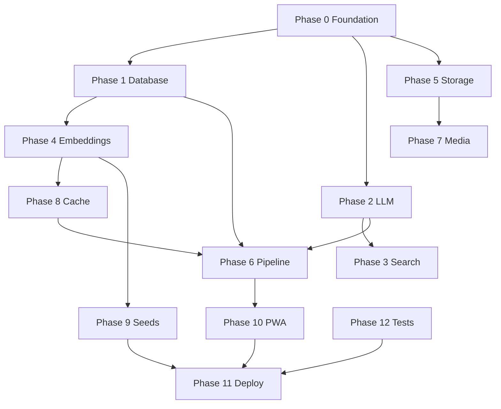

# Nigehban — Zero-Cost Implementation Plan

**Purpose:** Step-by-step engineering plan to migrate Nigehban to a **$0/month** stack without sacrificing multi-agent quality, Urdu support, or auditability.

**Scope:** Backend, AI pipeline, data layer, storage, search, embeddings, media forensics, caching, seed data, deployment, and frontend PWA hardening.

**Out of scope (deferred):** WhatsApp / messaging channel choice — decision pending.

**Companion docs:**
- [`Nigehban_Zero_Cost_Stack.md`](./Nigehban_Zero_Cost_Stack.md) — architecture rationale
- [`Nigehban_Backend_Production_Spec.md`](./Nigehban_Backend_Production_Spec.md) — API & data model reference
- [`Nigehban_PRD.md`](./Nigehban_PRD.md) — product requirements

**Estimated calendar time:** 4–6 weeks (1 engineer full-time) or 2–3 weeks (2 engineers parallelizing Phases 1–3)

---

## Table of Contents

1. [Guiding principles](#1-guiding-principles)
2. [Target architecture](#2-target-architecture)
3. [Phase overview](#3-phase-overview)
4. [Phase 0 — Foundation & dev environment](#4-phase-0--foundation--dev-environment)
5. [Phase 1 — Database & persistence](#5-phase-1--database--persistence)
6. [Phase 2 — LLM provider abstraction](#6-phase-2--llm-provider-abstraction)
7. [Phase 3 — Search & grounding](#7-phase-3--search--grounding)
8. [Phase 4 — Embeddings & vector search](#8-phase-4--embeddings--vector-search)
9. [Phase 5 — Storage & uploads](#9-phase-5--storage--uploads)
10. [Phase 6 — Pipeline hardening](#10-phase-6--pipeline-hardening)
11. [Phase 7 — Media forensics (open models)](#11-phase-7--media-forensics-open-models)
12. [Phase 8 — Caching & cost control](#12-phase-8--caching--cost-control)
13. [Phase 9 — Seed data & ingestion](#13-phase-9--seed-data--ingestion)
14. [Phase 10 — Frontend & PWA](#14-phase-10--frontend--pwa)
15. [Phase 11 — Deployment (Oracle Cloud)](#15-phase-11--deployment-oracle-cloud)
16. [Phase 12 — Testing & quality gates](#16-phase-12--testing--quality-gates)
17. [Dependency graph](#17-dependency-graph)
18. [Risk register](#18-risk-register)
19. [Definition of done](#19-definition-of-done)

---

## 1. Guiding principles

1. **Agents stay unchanged** — swap providers behind `LLMService`, `WebSearchService`, `EmbeddingService`, `StorageService`.
2. **Grounding over guessing** — verdicts cite DuckDuckGo/RSS/curated URLs; no source → `unverified` / low confidence.
3. **Judge + confidence floor always on** — independent of model vendor.
4. **Local-first** — Ollama + fastembed + MinIO on one VM; Groq optional for dev only.
5. **Every agent step logged** — `agent_logs` persisted for transparency.
6. **WhatsApp deferred** — no work on Meta WhatsApp until product decision; existing webhook code can remain dormant.

---

## 2. Target architecture

```
┌──────────────────────────────────────────────────────────────────┐
│ Oracle Cloud Always Free VM (ARM, ~24GB RAM) OR local dev machine │
├──────────────────────────────────────────────────────────────────┤
│ Caddy → Next.js (standalone) + FastAPI                            │
│ Ollama: qwen2.5:7b-instruct (fast) + qwen2.5:14b-instruct (judge) │
│ fastembed: BAAI/bge-m3 (1024-dim) in API process                  │
│ Docker: postgres+pgvector, redis, minio                             │
│ DuckDuckGo + RSS + curated_reference_urls table                     │
│ imagehash + transformers (deepfake) + exifread                    │
└──────────────────────────────────────────────────────────────────┘
```

**New Python dependencies** (add to `apps/api/pyproject.toml`):

| Package | Purpose |
|---------|---------|
| `httpx` | Already present — Ollama HTTP client |
| `duckduckgo-search` | Free web search |
| `fastembed` | Local embeddings |
| `minio` or keep httpx for S3 API | MinIO client (optional) |
| `exifread` | Metadata forensics |
| `imagehash` | Perceptual hash dedup |
| `opencv-python-headless` | Frame / region analysis |
| `transformers` + `torch` (CPU) | Deepfake classifier |
| `feedparser` | RSS parsing (if not using raw XML) |

---

## 3. Phase overview

| Phase | Name | Duration | Depends on | Delivers |
|-------|------|----------|------------|----------|
| 0 | Foundation | 2–3 days | — | Docker stack, config, provider flags |
| 1 | Database | 2–3 days | 0 | Alembic migrations, indexes |
| 2 | LLM abstraction | 3–4 days | 0 | Ollama + Groq providers |
| 3 | Search & grounding | 2–3 days | 2 | Real evidence retrieval |
| 4 | Embeddings | 2–3 days | 1 | fastembed + pgvector 1024 |
| 5 | Storage | 1–2 days | 0 | MinIO + no `/tmp` uploads |
| 6 | Pipeline hardening | 3–4 days | 1, 2 | Agent logs, workers, errors |
| 7 | Media forensics | 3–5 days | 5 | Open CV / HF models |
| 8 | Caching | 2–3 days | 4 | L1–L4 Redis caches |
| 9 | Seed data | 2–3 days | 4 | 30 scams + 20 claims + RSS |
| 10 | Frontend PWA | 2–3 days | 5, 6 | Mobile submit + offline shell |
| 11 | Deployment | 2–3 days | 0–10 | Oracle VM + Caddy + TLS |
| 12 | Testing | Ongoing | All | CI, integration tests |

**Parallelization:** Phases 3 + 4 + 5 can run in parallel after Phase 1 starts. Phase 7 can start after Phase 5.

---

## 4. Phase 0 — Foundation & dev environment

**Goal:** One command starts the full free stack locally.

### 4.1 Tasks

| ID | Task | Files | Details |
|----|------|-------|---------|
| 0.1 | Extend `docker-compose.yml` | `docker-compose.yml` | Add `minio`, `ollama` services; optional `ollama` profile for machines without GPU |
| 0.2 | Provider settings | `app/core/config.py` | Add `LLM_PROVIDER=ollama\|groq\|anthropic`, `OLLAMA_BASE_URL`, `OLLAMA_MODEL_FAST`, `OLLAMA_MODEL_REASONING`, `GROQ_API_KEY`, `EMBEDDING_MODEL`, `SEARCH_PROVIDER=duckduckgo` |
| 0.3 | Update `.env.example` | `.env.example` | Align names with `config.py`; document zero-cost defaults |
| 0.4 | Dev bootstrap script | `scripts/dev-up.sh` or `Makefile` | `docker compose up`, `ollama pull` models, `alembic upgrade head` |
| 0.5 | Document local RAM needs | `docs/` | 16GB+ recommended for 7B+14B concurrently |

### 4.2 `docker-compose.yml` additions (sketch)

```yaml
  minio:
    image: minio/minio
    command: server /data --console-address ":9001"
    ports: ["9000:9000", "9001:9001"]
    environment:
      MINIO_ROOT_USER: minioadmin
      MINIO_ROOT_PASSWORD: minioadmin
    volumes: [minio_data:/data]

  ollama:
    image: ollama/ollama
    ports: ["11434:11434"]
    volumes: [ollama_data:/root/.ollama]
```

### 4.3 Acceptance criteria

- [ ] `docker compose up -d` starts postgres, redis, minio, ollama
- [ ] `curl http://localhost:11434/api/tags` lists pulled models
- [ ] API starts with `LLM_PROVIDER=ollama` and no `ANTHROPIC_API_KEY`

---

## 5. Phase 1 — Database & persistence

**Goal:** Versioned schema, production indexes, agent log persistence.

### 5.1 Tasks

| ID | Task | Files | Details |
|----|------|-------|---------|
| 1.1 | Initial Alembic migration | `alembic/versions/001_initial.py` | All tables from models; `CREATE EXTENSION vector` |
| 1.2 | Change embedding dimension | Migration `002_embedding_1024.py` | `vector(1536)` → `vector(1024)` on `claims`, `scam_reports`, `scam_patterns` |
| 1.3 | New table: `curated_references` | `app/models/curated_reference.py` | `url`, `title`, `publisher`, `category`, `keywords[]` for static grounding |
| 1.4 | New table: `media_fingerprints` | `app/models/media_fingerprint.py` | `phash`, `file_hash`, `media_check_id`, `embedding` for reverse match |
| 1.5 | Indexes | Migration | HNSW on embeddings; partial index on `claims` WHERE `verdict IS NOT NULL` |
| 1.6 | Agent log writer | `app/agents/base.py` | After `execute()`, insert `AgentLog` row with `raw_output` |
| 1.7 | Orchestrator trail fix | `app/agents/orchestrator.py` | Include all path agents in `agent_trail`, not only intake+judge |

### 5.2 Agent log persistence (implementation note)

In `BaseAgent.execute()`, after successful run:

```python
async def _persist_agent_log(self, parent_check_id, parent_check_type, result):
    async with AsyncSessionLocal() as session:
        log = AgentLog(
            parent_check_id=parent_check_id,
            parent_check_type=parent_check_type,
            agent_name=self.name,
            output_summary=self._summarize_output(result["output"]),
            confidence=result.get("confidence"),
            latency_ms=result["_meta"]["latency_ms"],
            raw_output=result.get("output"),
        )
        session.add(log)
        await session.commit()
```

### 5.3 Acceptance criteria

- [ ] `alembic upgrade head` on empty DB creates full schema
- [ ] `GET /checks/{id}` returns complete agent trail from `agent_logs`
- [ ] pgvector extension enabled; similarity query runs without error

---

## 6. Phase 2 — LLM provider abstraction

**Goal:** Replace hardcoded Anthropic client with pluggable providers; Ollama as default.

### 6.1 Tasks

| ID | Task | Files | Details |
|----|------|-------|---------|
| 2.1 | Provider interface | `app/services/llm/base.py` | `async def complete(system, messages, model_tier, max_tokens) -> LLMResult` |
| 2.2 | Ollama provider | `app/services/llm/ollama.py` | POST `/api/chat`; map `haiku` → `OLLAMA_MODEL_FAST`, `sonnet` → `OLLAMA_MODEL_REASONING` |
| 2.3 | Groq provider | `app/services/llm/groq.py` | OpenAI-compatible API; dev fallback |
| 2.4 | Anthropic provider | `app/services/llm/anthropic.py` | Move current `llm.py` logic here |
| 2.5 | Factory | `app/services/llm/__init__.py` | `get_llm_service()` based on `settings.LLM_PROVIDER` |
| 2.6 | Update `BaseAgent.call_llm` | `app/agents/base.py` | Use factory; no agent file changes otherwise |
| 2.7 | JSON extraction helper | `app/services/llm/parsing.py` | Strip markdown fences; retry once on invalid JSON |
| 2.8 | Ollama health in `/health` | `app/main.py` | Optional `ollama: ok` when provider is ollama |

### 6.2 Ollama request shape

```python
# model_tier "haiku" → settings.OLLAMA_MODEL_FAST (qwen2.5:7b-instruct)
payload = {
    "model": model_name,
    "messages": [{"role": "system", "content": system}, *messages],
    "stream": False,
    "options": {"temperature": 0},
}
```

### 6.3 Model assignment (zero-cost default)

| `model_tier` in agent | Ollama model | Agents |
|------------------------|--------------|--------|
| `haiku` | `qwen2.5:7b-instruct` | intake, claim_extraction, evidence rank, cross_ref, OCR, pattern_match, risk_signal, metadata, reverse_search |
| `sonnet` | `qwen2.5:14b-instruct` | all `*_verdict_synthesis`, `judge` |

**Exception:** `visual_analysis` and `audio_sync` move to Phase 7 (non-LLM).

### 6.4 Acceptance criteria

- [ ] Full fact-check path completes with `LLM_PROVIDER=ollama` only
- [ ] Full scam-check path completes with Ollama
- [ ] Switching to `groq` works without code changes (env only)
- [ ] Judge still enforces confidence &lt; 50 → safe verdict
- [ ] p95 text check ≤ 25s on 7B+14B on dev hardware (target; tune timeouts)

---

## 7. Phase 3 — Search & grounding

**Goal:** Replace mock search with free, real URLs for fact-check evidence.

### 7.1 Tasks

| ID | Task | Files | Details |
|----|------|-------|---------|
| 3.1 | DuckDuckGo provider | `app/services/search/duckduckgo.py` | `DDGS().text(query, region="pk-en", max_results=8)` |
| 3.2 | Search factory | `app/services/search/__init__.py` | `SEARCH_PROVIDER=duckduckgo\|mock` |
| 3.3 | Curated reference search | `app/services/search/curated.py` | SQL keyword match on `curated_references` |
| 3.4 | Merge results | `app/services/search/service.py` | DDG + curated + dedupe by URL |
| 3.5 | Update `EvidenceRetrievalAgent` | `app/agents/factcheck/evidence_retrieval.py` | Use merged search; LLM ranks only |
| 3.6 | RSS link as sources | `app/workers/ingestion.py` | Store feed entry URL in `claims.sources` |
| 3.7 | Rate limit DDG | `app/services/search/duckduckgo.py` | Max 30 queries/min; backoff on failure |

### 7.2 Curated references seed (JSON)

Create `apps/api/seeds/curated_references.json`:

```json
[
  {
    "url": "https://www.sbp.org.pk/",
    "title": "SBP Consumer Fraud Advisories",
    "publisher": "State Bank of Pakistan",
    "category": "phishing",
    "keywords": ["loan", "otp", "sbp", "account suspended"]
  }
]
```

Load via `scripts/seed_curated.py`.

### 7.3 Acceptance criteria

- [ ] Fact-check on known SBP loan scam returns at least one real `.pk` or SBP URL in `sources`
- [ ] Mock provider still available for CI (`SEARCH_PROVIDER=mock`)
- [ ] No hallucinated URLs in judge output when search returns empty (verdict → unverified)

---

## 8. Phase 4 — Embeddings & vector search

**Goal:** Replace hash stub with `fastembed` + pgvector at 1024 dimensions.

### 8.1 Tasks

| ID | Task | Files | Details |
|----|------|-------|---------|
| 4.1 | fastembed integration | `app/services/embeddings.py` | `TextEmbedding(model_name="BAAI/bge-m3")`; lazy singleton |
| 4.2 | Dimension constant | `app/services/embeddings.py` | `EMBEDDING_DIM = 1024` |
| 4.3 | Model migration | Alembic `002` | Alter vector columns |
| 4.4 | Background embed on save | `app/workers/tasks.py` | After pipeline, embed claim/scam text → update row |
| 4.5 | Pattern match threshold tune | `pattern_match.py`, `cross_reference.py` | Calibrate on seed data (target: known scam ≥ 0.82 similarity) |
| 4.6 | Seed script embeddings | `scripts/seed_scam_patterns.py` | Embed all patterns on insert |

### 8.2 CPU / memory note

`BAAI/bge-m3` loads ~1–2 GB RAM. Run embedding in API process or dedicated worker thread pool (`asyncio.to_thread`).

### 8.3 Acceptance criteria

- [ ] Paste known seed scam text → `pattern_match` returns ≥ 0.8 similarity
- [ ] Duplicate claim submission → `cross_reference` finds prior verdict
- [ ] `similarity_search` completes &lt; 100ms for 10k patterns

---

## 9. Phase 5 — Storage & uploads

**Goal:** All uploads go to MinIO/local via `StorageService`; remove `/tmp` paths.

### 9.1 Tasks

| ID | Task | Files | Details |
|----|------|-------|---------|
| 5.1 | MinIO in compose | `docker-compose.yml` | See Phase 0 |
| 5.2 | Default MinIO in dev `.env` | `.env.example` | `S3_ENDPOINT=http://localhost:9000`, keys, bucket |
| 5.3 | Refactor scamcheck submit | `app/api/v1/scamcheck.py` | `storage.upload_file()` instead of tempfile |
| 5.4 | Refactor mediacheck submit | `app/api/v1/mediacheck.py` | Same |
| 5.5 | Media serve route | `app/api/v1/media.py` (new) | `GET /media/{id}` signed or public read for pipeline |
| 5.6 | Retention job stub | `app/workers/cleanup.py` | Delete objects older than 30 days |
| 5.7 | WhatsApp image path | `webhooks/whatsapp.py` | Use storage (keep dormant until channel decision) |

### 9.3 Acceptance criteria

- [ ] Upload image via scam checker → `file_url` points to MinIO URL
- [ ] Pipeline can `download_file()` from that URL
- [ ] No files left in `/tmp` after request completes

---

## 10. Phase 6 — Pipeline hardening

**Goal:** Reliable async processing, proper errors, trend snapshots.

### 10.1 Tasks

| ID | Task | Files | Details |
|----|------|-------|---------|
| 6.1 | Task queue interface | `app/workers/queue.py` | `enqueue_pipeline(check_id, type, input)` |
| 6.2 | Redis queue implementation | `app/workers/redis_queue.py` | `LPUSH pipeline:jobs`; worker loop |
| 6.3 | Worker process | `app/workers/runner.py` | `python -m app.workers.runner` — separate from API |
| 6.4 | API uses queue | `factcheck.py`, `scamcheck.py`, etc. | Replace `asyncio.create_task` |
| 6.5 | Pipeline short-circuit | `orchestrator.py` | If L1 cache hit, skip agents, return cached verdict |
| 6.6 | Category assignment | `tasks.py` `_save_result` | Set `claim.category` from intake/synthesis output |
| 6.7 | Trend snapshot job | `app/workers/trend_snapshot.py` | Every 15 min: `TrendCalculator` → insert `trend_snapshots` |
| 6.8 | Dashboard enrich | `app/api/v1/dashboard.py` | Join entity title/verdict on trending items |
| 6.9 | Rate limiter → Redis | `app/utils/rate_limiter.py` | Sliding window per IP |

### 10.2 Acceptance criteria

- [ ] API restart does not lose in-flight jobs (jobs in Redis queue)
- [ ] Dashboard `/trending` shows real `spread_score`, not placeholder 50
- [ ] Feed shows `category` on items
- [ ] Duplicate text submit returns cached result in &lt; 2s (after Phase 8 L1)

---

## 11. Phase 7 — Media forensics (open models)

**Goal:** Replace LLM-only visual/audio agents with real signals.

### 11.1 Tasks

| ID | Task | Files | Details |
|----|------|-------|---------|
| 7.1 | Metadata agent rewrite | `metadata_extract.py` | `exifread` + Pillow; no LLM for EXIF |
| 7.2 | Visual agent rewrite | `visual_analysis.py` | HF image classifier OR `OpenCV` + heuristics; load model once at startup |
| 7.3 | Frame extractor | `app/services/video.py` | `ffmpeg` subprocess; max 10 frames, 30s cap |
| 7.4 | Audio agent scope | `audio_sync.py` | v1: spectral stats via `librosa` if audio track exists; skip if image-only |
| 7.5 | Reverse search local | `reverse_search.py` | `imagehash.phash` lookup in `media_fingerprints` |
| 7.6 | Fingerprint on save | `tasks.py` | After media pipeline, store phash + embedding |
| 7.7 | Synthesis uses signals only | `mediacheck/verdict_synthesis.py` | LLM explains numeric signals, not imagines pixels |
| 7.8 | Dockerfile | `Dockerfile` | Add `ffmpeg`, model download step or lazy load |

### 11.2 Recommended model (CPU-friendly)

- **Deepfake:** `umm-maybe/AI-image-detector` or smaller MobileNet-based checkpoint
- Run inference in `asyncio.to_thread` to avoid blocking event loop
- **Fallback:** If model load fails, return `inconclusive` with explicit `model_unavailable` signal

### 11.3 Acceptance criteria

- [ ] Upload authentic photo → `likely_authentic` or high authenticity score with metadata signals populated
- [ ] Re-upload same image → reverse_search reports match
- [ ] Video ≤ 30s processed without OOM on 8GB RAM VM (with 7B unloaded during media job if needed)

---

## 12. Phase 8 — Caching & cost control

**Goal:** Implement L1–L4 from `app/cache/layers.py` in Redis.

### 12.1 Tasks

| ID | Task | Files | Details |
|----|------|-------|---------|
| 8.1 | L1 dedup cache | `cache/layers.py` | Key `dedup:{content_hash}` → full verdict JSON, TTL 24h |
| 8.2 | L2 similarity cache | `cache/layers.py` | Before pipeline, embed + search; if ≥ 0.92, return match |
| 8.3 | L3 evidence cache | `cache/layers.py` | Key `evidence:{claim_hash}` → search results, TTL 6h |
| 8.4 | L4 response cache | `cache/layers.py` | Key `verdict:{check_id}` for repeat GETs |
| 8.5 | Orchestrator integration | `orchestrator.py` | Check L1/L2 at start |
| 8.6 | Evidence agent integration | `evidence_retrieval.py` | Check L3 before DDG |
| 8.7 | Metrics | `app/core/metrics.py` | Counter `cache_hit{L1,L2,L3}` |

### 12.2 Acceptance criteria

- [ ] Identical scam text twice: second request skips LLM (cache hit log)
- [ ] Same claim within 6h: evidence retrieval does not call DuckDuckGo
- [ ] Cache hit rate &gt; 30% on demo script with repeated forwards

---

## 13. Phase 9 — Seed data & ingestion

**Goal:** Product looks credible at launch (PRD: ≥20 claims, ≥30 scam patterns).

### 13.1 Tasks

| ID | Task | Files | Details |
|----|------|-------|---------|
| 9.1 | Scam patterns seed | `seeds/scam_patterns.json` | 30+ patterns across PRD §17.5 categories, Urdu + English |
| 9.2 | Seed loader | `scripts/seed_all.py` | Patterns + embeddings + curated refs |
| 9.3 | Claims seed | `seeds/claims.json` | 20 pre-verified claims OR run pipeline on seed texts |
| 9.4 | RSS config | `.env` `RSS_FEED_URLS` | Dawn, BBC Urdu, Geo, etc. |
| 9.5 | Ingestion cron | `workers/ingestion.py` + scheduler | Hourly RSS pull in worker runner |
| 9.6 | Demo script | `scripts/demo_checks.sh` | curl submits for judge demo |

### 13.2 Scam pattern template

```json
{
  "pattern_text": "Congratulations! You won iPhone 15. Pay 5000 PKR customs fee to 03XX-XXXXXXX",
  "scam_type": "lottery_prize",
  "description_en": "Classic lottery scam asking upfront fee.",
  "description_ur": "قرعہ اندازی کی جعلی فتح — پہلے رقم مانگنا۔"
}
```

### 13.3 Acceptance criteria

- [ ] `GET /factcheck/feed` returns ≥ 20 items across ≥ 4 categories
- [ ] `GET /scamcheck/search?q=SBP` returns ≥ 3 pattern hits
- [ ] RSS ingestion adds ≥ 1 new claim per day when feeds configured

---

## 14. Phase 10 — Frontend & PWA

**Goal:** Mobile-first, installable web app (WhatsApp alternative for accessibility).

**Existing:** `ServiceWorkerRegistrar.tsx`, `register-sw.ts` — extend rather than rewrite.

### 14.1 Tasks

| ID | Task | Files | Details |
|----|------|-------|---------|
| 10.1 | PWA manifest | `apps/web/public/manifest.json` | Icons, `standalone`, Urdu name |
| 10.2 | API URL config | `apps/web/.env` | Point to deployed API |
| 10.3 | Offline shell | Service worker | Cache app shell; show offline message on submit |
| 10.4 | Mobile submit UX | `SubmissionForm.tsx` | Large paste area, camera capture for screenshots |
| 10.5 | SSE client | `use-submission.ts` | Subscribe to `/checks/{id}/stream` during processing |
| 10.6 | Share result | `ResultCard.tsx` | Web Share API + copy link for WhatsApp groups |
| 10.7 | Urdu RTL polish | feed/checker pages | `dir=rtl` when locale=ur |
| 10.8 | Next standalone build | `next.config.mjs` | `output: 'standalone'` for Caddy deploy |

### 14.2 Acceptance criteria

- [ ] Install PWA on Android Chrome; submit scam text end-to-end
- [ ] Share button copies verdict link
- [ ] Pipeline visualizer updates live via SSE

---

## 15. Phase 11 — Deployment (Oracle Cloud)

**Goal:** $0 production on Oracle Always Free.

### 15.1 Tasks

| ID | Task | Details |
|----|------|---------|
| 11.1 | Provision OCI ARM VM | Ubuntu 22.04, 12–24 GB RAM |
| 11.2 | Install Docker + compose | Run full stack |
| 11.3 | Ollama models on boot | systemd unit or compose depends_on + pull script |
| 11.4 | Caddy config | TLS (Let's Encrypt), reverse proxy to API :8000 and Next :3000 |
| 11.5 | Firewall | 80, 443 only public |
| 11.6 | Backup cron | `pg_dump` daily to MinIO bucket |
| 11.7 | Log rotation | journald + max size |
| 11.8 | Optional domain | Cloudflare DNS → VM (free) |

### 15.2 Caddy sketch

```
nigehban.pk {
  reverse_proxy /api/* localhost:8000
  reverse_proxy localhost:3000
}
```

### 15.3 Acceptance criteria

- [ ] Public HTTPS URL serves feed and completes a live check
- [ ] VM survives reboot; all services auto-start
- [ ] DB backup restorable

---

## 16. Phase 12 — Testing & quality gates

### 16.1 Test matrix

| Layer | Tool | Coverage target |
|-------|------|-----------------|
| Unit | pytest | LLM parsing, PII redaction, spread score, phash |
| Integration | pytest + httpx | Submit → poll → verdict for each path |
| Search | pytest | DDG returns list (mark network tests optional) |
| Embeddings | pytest | Known pair similarity &gt; threshold |
| E2E | Playwright (optional) | Web submit flow |

### 16.2 CI pipeline (GitHub Actions, free)

```yaml
jobs:
  test:
    runs-on: ubuntu-latest
    services:
      postgres: ...
      redis: ...
    env:
      LLM_PROVIDER: mock
      SEARCH_PROVIDER: mock
    steps:
      - pytest apps/api/tests
```

### 16.3 Mock LLM provider

`app/services/llm/mock.py` — deterministic JSON responses for CI without Ollama.

### 16.4 Acceptance criteria

- [ ] CI passes on every PR
- [ ] Integration test covers fact + scam + media happy paths
- [ ] No test requires paid API keys

---

## 17. Dependency graph



---

## 18. Risk register

| Risk | Impact | Mitigation |
|------|--------|------------|
| Ollama 14B too slow on small VM | Slow UX | Groq dev; quantize model; judge-only 14B |
| DuckDuckGo blocks datacenter IP | No search results | Curated refs + RSS; residential proxy last resort |
| fastembed RAM on small VM | OOM | Lazy load; embed worker; smaller model fallback |
| HF model download size | Deploy friction | Pre-bake in Docker image |
| Oracle account approval | No free host | Local PC or second choice: home server |
| Urdu OCR quality | Bad scam OCR | Show extracted text for user confirm (PRD) |
| WhatsApp decision delayed | Scope creep | Keep webhook code; no Phase work until decided |

---

## 19. Definition of done

The zero-cost implementation is **complete** when:

### Functional
- [ ] User can submit text, screenshot, image, video on web PWA
- [ ] All three pipeline paths return verdict + Urdu explanation + agent trail
- [ ] Feed, search, dashboard work with seed + live data
- [ ] No paid API keys required in production `.env`

### Technical
- [ ] Alembic migrations applied; no manual schema hacks
- [ ] LLM_PROVIDER=ollama, SEARCH_PROVIDER=duckduckgo, embeddings=fastembed
- [ ] Uploads on MinIO; retention job scheduled
- [ ] L1–L4 caches operational
- [ ] Worker process separate from API
- [ ] CI green with mock providers

### Quality
- [ ] Judge confidence floor enforced in tests
- [ ] Fact-check with no sources → `unverified` or confidence ≤ 60
- [ ] Known seed scam matches at ≥ 0.8 similarity
- [ ] Media check returns structured `signals`, not LLM-only prose

### Operational
- [ ] Deployed on Oracle (or equivalent) with HTTPS
- [ ] `/health` reports db, redis, ollama
- [ ] Daily DB backup verified

### Explicitly not required (deferred)
- WhatsApp / Telegram / any messaging channel
- Paid Anthropic, OpenAI, R2, or search APIs
- Sentry (optional)

---

## Appendix A — File change index

| Area | New files | Modified files |
|------|-----------|----------------|
| LLM | `services/llm/base.py`, `ollama.py`, `groq.py`, `anthropic.py`, `mock.py`, `parsing.py` | `agents/base.py`, delete/replace `services/llm.py` |
| Search | `services/search/duckduckgo.py`, `curated.py`, `service.py` | `evidence_retrieval.py` |
| Embeddings | — | `embeddings.py`, models, alembic |
| Storage | `api/v1/media.py` | `scamcheck.py`, `mediacheck.py` |
| Cache | — | `cache/layers.py`, `orchestrator.py` |
| Workers | `queue.py`, `redis_queue.py`, `runner.py`, `trend_snapshot.py`, `cleanup.py` | `tasks.py`, API routes |
| Media | `services/video.py`, `models/media_fingerprint.py` | mediacheck agents, Dockerfile |
| Seeds | `seeds/*.json`, `scripts/seed_*.py` | — |
| Infra | `docker-compose.yml`, Caddyfile | `.env.example` |
| Frontend | `manifest.json` | `next.config.mjs`, submission hooks |

---

## Appendix B — Suggested week-by-week schedule (1 engineer)

| Week | Focus |
|------|-------|
| 1 | Phase 0, 1, 2 (foundation, DB, Ollama LLM) |
| 2 | Phase 3, 4, 5 (search, embeddings, storage) |
| 3 | Phase 6, 8 (pipeline, cache, workers) |
| 4 | Phase 7, 9 (media forensics, seeds) |
| 5 | Phase 10, 11, 12 (PWA, deploy, tests) |

---

*End of implementation plan.*
